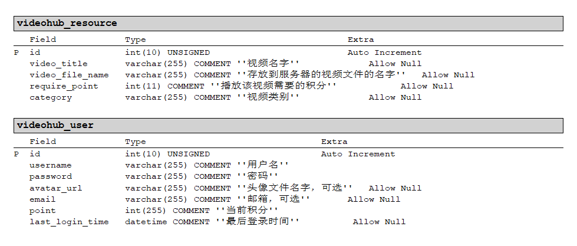
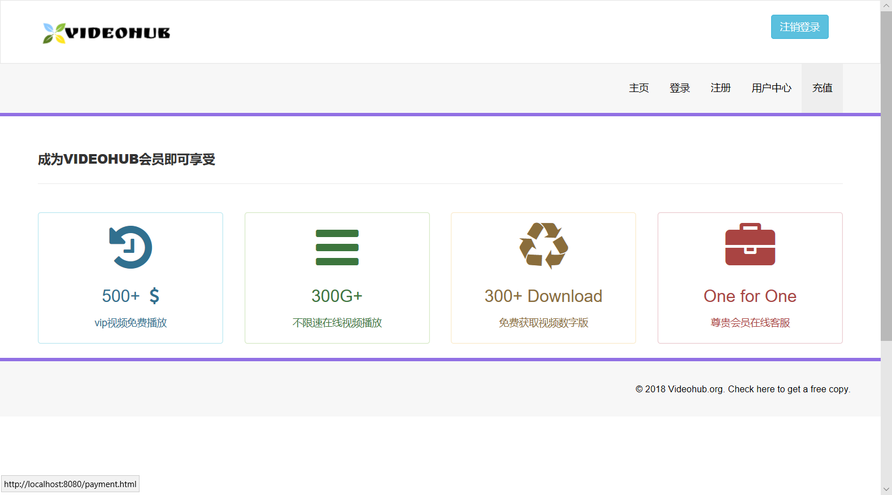

# videohub 开源视频在线网站

# 任务
做一个在线视频播放网站，类似于bilibili，爱奇艺的简化版。

主要逻辑是：
首先用户访问这个网站的主页，主页显示视频列表，有点类似于卡片，每个卡片都可以点进去，每次点进去要扣积分，点进去之后进入播放页面，这里有个判断如果没有登录就跳到登录。积分不足会跳到充值界面，充值完成就更新数据库积分。个人中心是逻辑独立的，里面可以显示头像，ip，积分，等级这些信息。  
需求分析：
用户端登入注册，未登入用户无权限访问视频，用户端有上传视频、观看视频、积分查询、积分充值。
主页功能：展示部分视频缩略图，有查询视频功能，关键字搜索，登入，注册，商城。

# sql

数据库名为`videohub`，数据表大概如图所示，后面可根据需求改变

[sql文件](sql/videohub.sql)

# 效果预览

